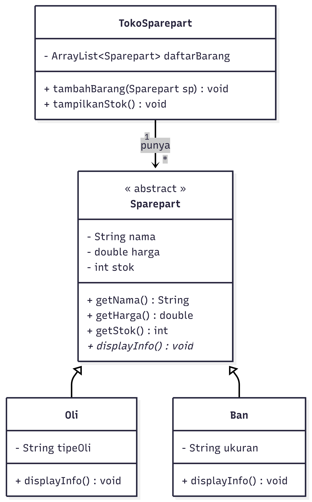
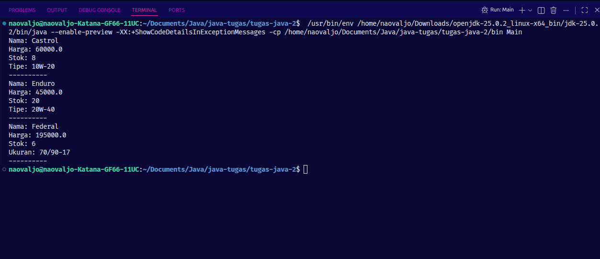

# Toko Sparepart Motor

## Deskripsi Kasus
Kenapa saya memilih kasus ini, karena orang tua saya memiliki bisnis onderdil dan bengkel motor. dan saya memilih kasus ini karena bisnis onderdil dan bengkel orang tua saya belum auto pilot dan masih menggunakan sistem manual. saya berambisi ingin mengembangkan sistem yang otomatis agar bisnis tersebut bisa auto pilot. meskipun program ini yang saya buat masih sangat sederhana tapi ini adalah rancangan awal bagaimana saya menerapkan sistem otomatis terhadap bisnis di onderdil motor dan bengkel.

program ini mensimulasikan sistem manajemen toko sparepart motor sederhana yang bisa mengelola data barang, contoh barangnya yaitu oli dan ban.

## Class Diagram



## Kode Program

### Sparepart.java
```java

public abstract class Sparepart {

    private String nama;
    private double harga;
    private int stok;

    // constructor
    public Sparepart(String nama, double harga, int stok) {
        this.nama = nama;
        this.harga = harga;
        this.stok = stok;
    }

    // getter
    public String getNama() {
        return nama;
    }
    public double getHarga() {
        return harga;
    }
    public int getStok() {
        return stok;
    }

    // method
    public abstract void displayInfo();
 
}

```

### Oli.java
```java

public class Oli extends Sparepart {
    // attribute
    private String tipeOli;

    // constructor
    public Oli(String nama, double harga, int stok, String tipeOli) {
        super(nama, harga, stok);
        this.tipeOli = tipeOli;
    }

    // getter
    public String getTipeOli() {
        return tipeOli;
    }

    // override
    @Override
    public void displayInfo() {
        System.out.println("Nama: " + getNama());
        System.out.println("Harga: " + getHarga());
        System.out.println("Stok: " + getStok());
        System.out.println("Tipe: " + tipeOli);
    } 
}

```

### Ban.java
```java

public class Ban extends Sparepart {

    // attribute
    private String ukuran;

    // constructor
    public Ban(String nama, double harga, int stok, String ukuran) {
        super(nama, harga, stok);
        this.ukuran = ukuran;
    }

    // getter
    public String getUkuran() {
        return ukuran;
    }

    // override
    @Override
    public void displayInfo() {
        System.out.println("Nama: " + getNama());
        System.out.println("Harga: " + getHarga());
        System.out.println("Stok: " + getStok());
        System.out.println("Ukuran: " + ukuran);
    }
    

}

```

### TokoSparepart.java
```java

import java.util.ArrayList;

public class TokoSparepart {
    private ArrayList<Sparepart> daftarBarang;

    public TokoSparepart() {
        daftarBarang = new ArrayList<>();  

    }

    public void tambahBarang(Sparepart sp) {
    daftarBarang.add(sp);

    }

    public void tampilkanStok() {
        for (Sparepart sp : daftarBarang) {
            sp.displayInfo();
            System.out.println("----------");
        }
    }

}


```

### Main.java
```java

public class Main {
    public static void main(String[] args) {
        TokoSparepart toko = new TokoSparepart();

        Oli oli1 = new Oli("Castrol", 60000, 8, "10W-20");
        Oli oli2 = new Oli("Enduro", 45000, 20, "20W-40");
        Ban ban1 = new Ban("Federal", 195000, 6, "70/90-17");

        toko.tambahBarang(oli1);
        toko.tambahBarang(oli2);
        toko.tambahBarang(ban1);

        toko.tampilkanStok();

    }
    
}

```

## Screenshot Output



## Prinsip OOP yang Diterapkan

### 1. Encapsulation

    private String nama;
    private double harga;
    private int stok;

    mengapa memakai private, agar di luar class tidak bisa langsung akses attribute tersebut. dan harus memakai getter
    jika ingin mengakses attributenya. ini untuk melindungi agar tidak sembarang diubah dari luar.

### 2. Inheritance

    public class Oli extends Sparepart {...}
    public class Ban extends Sparepart {...}

    Oli dan Ban mewarisi attribut dari parent class, seperti nama, harga, stok, dll. jadi tidak perlu menulis berulang-
    ulang dan tinggal memanggil attribute dari parent class.

### 3. Polymorphism

     public void tampilkanStok() {
        for (Sparepart sp : daftarBarang) {
            sp.displayInfo();
            System.out.println("----------");
        }
    }

    Polymorphism diterapkan pada method displayInfo(). Oli dan Ban juga memiliki method ini, tapi isi dan outputnya sesuai
    jenis sparepartnya.

### 4. Abstraction

    public abstract class Sparepart {...}
    public abstract void displayInfo();

    Sparepart tidak bisa dibuat objeknya langsung new Sparepart() (ini akan error). dia cuma jadi cetakan yang bisa dibuat oleh anak turunannya, yaitu Oli dan Ban. Method displayInfo() dideklarasikan tanpa isi. jadi, anak turunannya yang harus mengisinya.

## Keunikan Program

    Menggunakan fitur ArrayList jadi program bisa menambahkan barang secara dinamis. dan program ini bisa dikembangkan lebih lanjut misal ada fitur transaksi dll.
    
